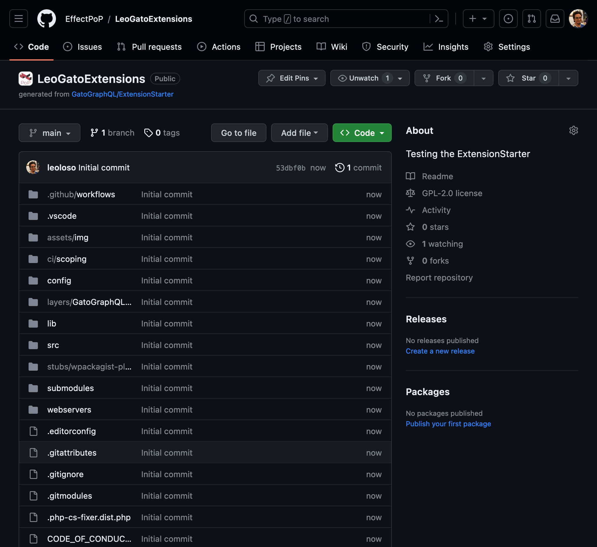
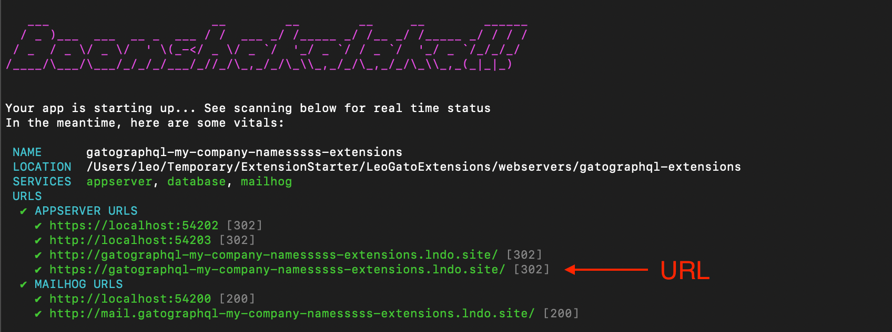
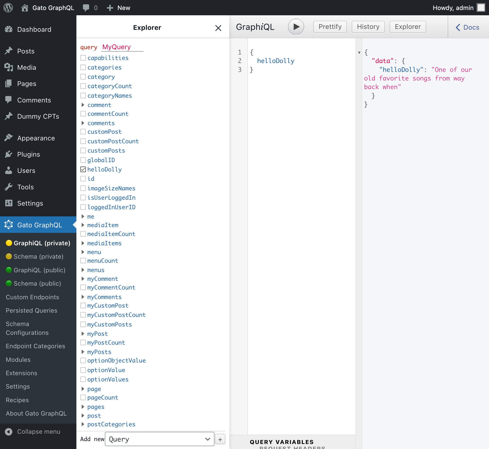
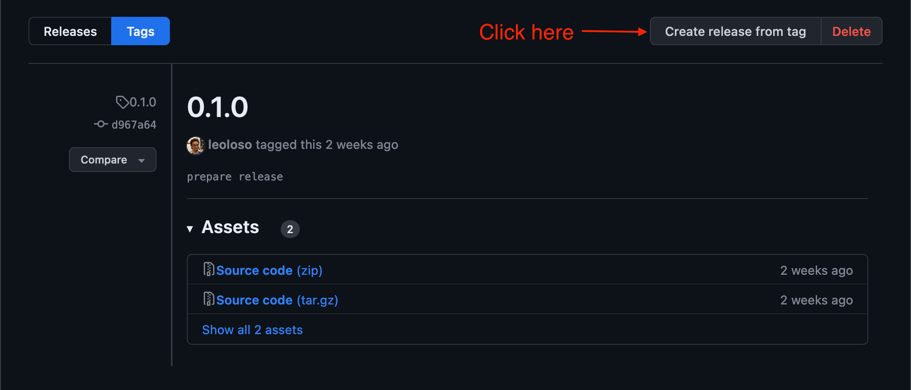
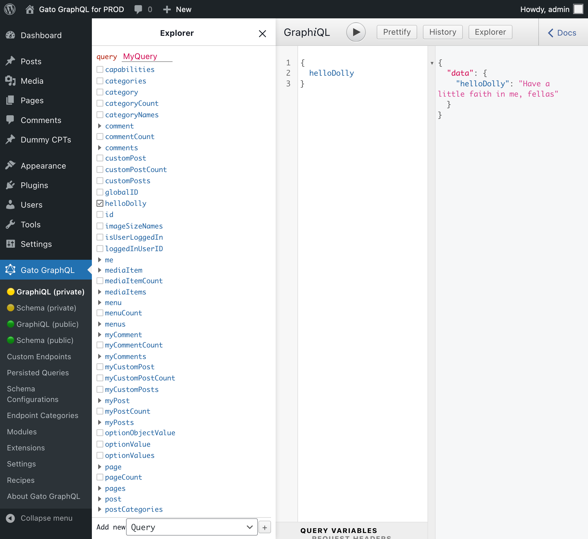

<p align="center"></p>


<!--
@gatographql-project-info

Show a badge for the integration tests against InstaWP

@gatographql-project-action-maybe-required

If these tests are enabled, add the badge code:


-->

# Gato GraphQL - Extension Starter

Gato GraphQL extensions add functionality and expand the GraphQL schema provided by [Gato GraphQL](https://github.com/GatoGraphQL/GatoGraphQL).

**This template repository helps you kickstart a GitHub repo, to develop, test and release your own extensions for Gato GraphQL.**

<!-- To learn about the features provided by the multi-monorepo architecture on this starter project, visit [Multi-Monorepo (Architecture of the Extension Starter)](docs/Multi-Monorepo_Architecture.md). -->

<details>

<summary>Trivia fact 🤔</summary>

_All extensions from [gatographql.com/extensions](https://gatographql.com/extensions/) (26 extensions and 4 bundles to date) are hosted on a monorepo created from `GatoGraphQL/ExtensionStarter` 🚀_

</details>

## Requirements

- PHP 8.1
- [Lando](https://lando.dev/)
- [Composer](https://getcomposer.org/)

### Recommended to use

- [XDebug](https://xdebug.org/) (integrated out of the box when using [VSCode](https://code.visualstudio.com/) and the [PHP Debug](https://marketplace.visualstudio.com/items?itemName=xdebug.php-debug) addon for VSCode)

## Create your Extension Project

Follow these steps:

### Create your repo from this GitHub template

- Click on `Use this template` → `Create a new repository`
- Select the GitHub owner, and choose a proper name for your repository (eg: `my-account/GatoGraphQLExtensionsForMyCompany`)
- Choose if to make it Public or Private
- Click on `Create repository`

As a result, a copy of this template will have been created under your GitHub repo:



### Clone your repo locally

Clone your repository in your local drive using the `--recursive` option (needed to clone Git submodule `GatoGraphQL/GatoGraphQL`):

```bash
git clone --recursive https://github.com/my-account/GatoGraphQLExtensionsForMyCompany
```

### Install Composer dependencies

Run:

```bash
$ cd {project folder}
$ cd submodules/GatoGraphQL && composer install && cd ../.. && composer install
```

### Initialize the Project

This step will replace all the generic strings in the extension starter (the PHP namespace `MyCompanyForGatoGraphQL`, company name `My Company`, and others) with the values corresponding to your project.

Input your values in the command below and run:

```bash
composer initialize-project -- \
  --php-namespace-owner=MyCompanyName \
  --my-company-name="My Company Name" \
  --my-company-email=email@mycompany.com \
  --my-company-website=https://www.mycompany.com
```

These arguments (and additional ones, see below) are optional. If any of them is not provided, a default value is computed from the configuration in Git and the GitHub repo.

<details>

<summary>Print arguments and default values for <code>initialize-project</code></summary>

To see the default values for the arguments, run:

```bash
composer initialize-project -- --dry-run
```

To print all the arguments for the `initialize-project` command, run:

```bash
composer initialize-project -- --help
```

</details>

<details>

<summary>View all <code>initialize-project</code> command arguments</summary>

| Option | Description |
| --- | --- |
| `--git-base-branch` | Base branch of the GitHub repository where this project is hosted. If not provided, this value is retrieved using `git` |
| `--git-user-name` | Git user name, to "split" code and push it to a different repo when merging a PR. If not provided, this value is retrieved from the global `git` config |
| `--git-user-email` | Git user email, to "split" code and push it to a different repo when merging a PR. If not provided, this value is retrieved from the global `git` config |
| `--github-repo-owner` | Owner of the GitHub repository where this project is hosted (eg: "GatoGraphQL" in "https://github.com/GatoGraphQL/ExtensionStarter"). If not provided, this value is retrieved using `git` |
| `--github-repo-name` | Name of the GitHub repository where this project is hosted (eg: "ExtensionStarter" in "https://github.com/GatoGraphQL/ExtensionStarter"). If not provided, this value is retrieved using `git` |
| `--docs-git-base-branch` | Base branch of the (public) GitHub repository hosting the documentation for the extension, to access the images in PROD. If not provided, the value for option `git-base-branch` is used |
| `--docs-github-repo-owner` | Owner of the (public) GitHub repository hosting the documentation for the extension, to access the images in PROD. If not provided, the value for option `github-repo-owner` is used |
| `--docs-github-repo-name` | Name of the (public) GitHub repository hosting the documentation for the extension, to access the images in PROD. If not provided, the value for option `github-repo-name` is used |
| `--php-namespace-owner` | PHP namespace owner to use in the codebase (eg: "MyCompanyName"). If not provided, the value from the "github-repo-owner" option is used |
| `--composer-vendor` | Composer vendor to distribute the packages in the repo. If not provided, it is generated from the "php-namespace-owner" option |
| `--my-company-name` | Name of the person or company owning the extension. If not provided, the value for option `git-user-name` is used |
| `--my-company-email` | Email of the person or company owning the extension. If not provided, the value for option `git-user-email` is used |
| `--my-company-website` | Website of the person or company owning the extension. If not provided, the GitHub repo for this project is used |

</details>

<details>

<summary>Browse documentation within the codebase</summary>

The codebase contains snippets of documentation, to explain some feature or configuration.

Search for the following PHPDoc tags in the codebase:

- `@gatographql-project-info`: Information on some aspect of the monorepo setup
- `@gatographql-project-action-maybe-required`: Indicates if some feature can be enabled/disabled and how
- `@gatographql-extension-info`: Information on some aspect of the extension setup
- `@gatographql-example`: Provides an example from the upstream monorepo
- `@gatographql-readonly-code`: Indicates that the code must not be changed, as it is automatically modified via some script

</details>

### Review the License

The [license in the monorepo](LICENSE) is GPL v2.

If this this not your license, remove/replace this file.

### Commit, Push and Tag the Initial Project

Review the changes applied to the codebase on the step above. If any value is not correct (eg: if the PHP namespace should be a different one), you can undo all changes (`git reset --hard HEAD`), and run `composer initialize-project` again providing the right values.

Once all values are right, run:

```bash
git add . && git commit -m "Initialized project" && git push origin && git tag 0.0.0 && git push --tags
```

This will commit the codebase to your GitHub repo, and tag it with version `0.0.0`. (This tag is needed to start incrementing the version automatically from now on.)

## Run the webserver for DEV

_(Instructions for running the webserver for PROD will be given further below.)_

A Lando webserver is set-up and configured to develop the extensions in the monorepo.

- Runs on PHP 8.1
- It directly uses the source code on the repo
- XDebug is enabled

Follow these steps:

### Build the Lando webserver for DEV

Run (only the first time):

```bash
composer build-server
```

After a few minutes, the website will be available under `https://gatographql-{composer-vendor}-extensions.lndo.site`.

(`{composer-vendor}` is an argument to the `initialize-project` command above; its default value is generated from the `php-namespace-owner` option.)

The URL is printed on the console under `APPSERVER URLS` (you will need to scroll up):



To print the URL again, run:

```bash
composer server-info
```

_(This command also prints other useful data, including the port to connect to the MySql database, so you can visualize and edit the data in the DB using an external client, such as MySQLWorkbench.)_

<details>

<summary>What plugins are installed in the webserver? 🤔</summary>

All plugins hosted on the "upstream" monorepo:

- [Gato GraphQL](https://github.com/GatoGraphQL/GatoGraphQL/blob/master/layers/GatoGraphQLForWP/plugins/gatographql/gatographql.php)
- [Gato GraphQL - Testing](https://github.com/GatoGraphQL/GatoGraphQL/blob/master/layers/GatoGraphQLForWP/phpunit-plugins/gatographql-testing/gatographql-testing.php)
- [Gato GraphQL - Testing Schema](https://github.com/GatoGraphQL/GatoGraphQL/blob/master/layers/GatoGraphQLForWP/plugins/testing-schema/gatographql-testing-schema.php)

(The last two are utilities to run integration tests for Gato GraphQL. Among others, they provide CPT "dummy-cpt" and custom taxonomies "dummy-category" and "dummy-tag").

All plugins hosted on this "downstream" starter monorepo:

- [Gato GraphQL - Hello Dolly](https://github.com/GatoGraphQL/ExtensionStarter/blob/main/layers/GatoGraphQLForWP/plugins/hello-dolly/gatographql-hello-dolly.php)

All the WordPress integration plugins, required by the extensions

- [Hello Dolly](https://wordpress.org/plugins/hello-dolly/)

Besides, some initial configuration is applied to the Gato GraphQL plugin Settings. For instance, the single endpoint is enabled (it is disabled by default).

</details>

### Log-in to the `wp-admin`

Credentials for `https://gatographql-{composer-vendor}-extensions.lndo.site/wp-admin/`:

- Username: `admin`
- Password: `admin`

### Open the Gato GraphQL plugin in the `wp-admin`

Click on the Gato GraphQL link on the menu to open the GraphiQL client, and execute the following GraphQL query:

```graphql
{
  helloDolly
}
```

<details>

<summary>Where does field <code>helloDolly</code> come from? 🤔</summary>

Field `Root.helloDolly` is added to the GraphQL schema by the "Gato GraphQL - Hello Dolly" demo extension hosted in this monorepo.

This field returns any quote from the Hello Dolly song. The following query:

```graphql
{
  helloDolly
}
```

will return:

```json
{
  "data": {
    "helloDolly": "Dolly, never go away again"
  }
}
```

...or any of the other lines in that song.

</details>

If the installation of the starter was successful, you will receive a response:



### Start the Lando webserver for DEV

Building the webserver (above) is needed only the first time.

From then on, run:

```bash
composer init-server
```

### Run Integration Tests for DEV

Run:

``` bash
composer integration-test
```

## Create an Extension Plugin

This section explains all the steps needed to add an extension plugin to the monorepo.

### Run command to create the extension

Run:

```bash
composer create-extension -- \
  --extension-name="Extension name"
```

If the extension is an integration for some WordPress plugin, run:

```bash
composer create-extension -- \
  --integration-plugin-name="Plugin name" \
  --integration-plugin-file=slug/file.php \
  --integration-plugin-version-constraint="..."
```

For instance, to build an integration for WooCommerce with version 8 or above, run:

```bash
composer create-extension -- \
  --integration-plugin-name=WooCommerce \
  --integration-plugin-file=woocommerce/woocommerce.php \
  --integration-plugin-version-constraint="^8"
```

<details>

<summary>Print arguments for <code>create-extension</code></summary>

To print all the arguments for the `create-extension` command, run:

```bash
composer create-extension -- --help
```

</details>

<details>

<summary>View all <code>create-extension</code> command arguments</summary>

| Option | Description |
| --- | --- |
| `--template` |  Template to use to create the extension plugin, from available options: "basic" [default: "basic"] |
| `--integration-plugin-file` | Integration plugin file (eg: "woocommerce/woocommerce.php" for the WooCommerce plugin), if any |
| `--integration-plugin-version-constraint` | Mimimum required version of the integration plugin, in semver (eg: "^8.1"). If not provided, any version is accepted [default: "*"] |
| `--integration-plugin-name` | Name of the integration plugin (eg: WooCommerce). If not provided, it is generated from the integration plugin slug |
| `--extension-name` | Extension plugin name. If not provided, it is calculated from the integration plugin name |
| `--extension-slug` | Slug of the extension plugin. If not provided, it is generated from the integration plugin's slug, or from the "extension-name" option |
| `--extension-classname` | PHP classname to append to classes in the extension plugin. If not provided, it is generated from the "extension-slug" option |

</details>

### Commit + Rebuild Lando webservers

After running the command above, execute the following bash commands to complete the process:

```bash
# (Git commit/push the changes to the repo)
git add . && git commit -m "Created new extension" && git push origin

# (Rebuild the Lando webserver for DEV)
composer rebuild-app-and-server

# (Install/activate the added plugins on the DEV webserver)
composer activate-extension-plugins

# (Install/activate the integration plugin on the PROD webserver) <= if already created
composer activate-extension-plugins-prod
```

## Complete the Extension Plugin

The new extension plugin created with the command above contains the comment `@gatographql-extension-todo` indicating that there are items to complete.

### Documentation

Complete the documentation for your module, under file:

`layers/GatoGraphQLForWP/plugins/{extension-slug}/docs/modules/schema-{extension-slug}/en.md`.

### Integration Tests for the Extension Schema

To test the schema elements added by the extension, complete the GraphQL document:

`layers/GatoGraphQLForWP/plugins/{extension-slug}/tests/Integration/fixture-schema/extension-schema.gql`

(and the JSON response, in the same folder).

### Stubs for your integration plugin

If integrating with another WordPress plugin, you will need to complete the file with stubs for that plugin (to avoid errors with PHPStan/Rector), under:

`stubs/wpackagist-plugin/{integration-plugin}/stubs.php`.

<details>

<summary>What are stubs needed for? And how to generate them? 🤔</summary>

Stubs are placeholders to "load" a functionality that is otherwise missing (because the plugin that contains it is not loaded when running unit tests and static analysis).

Stubs avoid PHPStan producing an error when analyzing packages which invoke classes, methods, constants, etc, from 3rd-party WordPress plugins. (Eg: [the stubs file for `hello-dolly`](stubs/wpackagist-plugin/hello-dolly/stubs.php) avoids an error from [calling `hello_dolly_get_lyric()` in the field resolver](layers/GatoGraphQLForWP/packages/hello-dolly-schema/src/FieldResolvers/ObjectType/RootObjectTypeFieldResolver.php)).

It also avoids Rector from producing errors when downgrading the code.

Stubs must be added for all the WordPress integration plugins for which there is an extension in the monorepo (eg: WooCommerce, Yoast SEO, etc).

The stub files, if not already available for that WordPress plugin, can be generated using [`php-stubs/generator`](https://github.com/php-stubs/generator) (check also [`php-stubs/wordpress-stubs`](https://github.com/php-stubs/wordpress-stubs)).

</details>

<!-- Point to a .gql test
Point to a .gql test when disabling the plugin
Point to a .gql test when disabling the module

Run hello-dolly tests:
  phpunit layers/GatoGraphQLForWP/plugins/hello-dolly/tests/Integration/SchemaFixtureWebserverRequestTest.php
  phpunit layers/GatoGraphQLForWP/plugins/hello-dolly/tests/Integration/EnableDisablePluginFixtureWordPressAuthenticatedUserWebserverRequestTest.php
  phpunit layers/GatoGraphQLForWP/plugins/hello-dolly/tests/Integration/FixtureThirdPartyPluginDependencyWordPressAuthenticatedUserWebserverRequestTest.php
Indicate the "enabled.json" and "only-one-enabled.json" items fail because of the random nature of the test
  But I kept them only for documentation, for your own tests
  alternatively with regex, could use test:
    submodules/GatoGraphQL/layers/GatoGraphQLForWP/phpunit-packages/gatographql/tests/Integration/AccessPrivatePersistedQuerySourceByAdminQueryExecutionFixtureWebserverRequestTest.php
Explain what each of them does! -->

<!--

_Doing this process manually is tedious and error-prone. We are already [working on a `create-extension` command](https://github.com/GatoGraphQL/ExtensionStarter/issues/73) to automate this process._

### Creating the extension manually

This starter project includes one fully-working extension plugin as demo: "Gato GraphQL - Hello Dolly", an integration for the [Hello Dolly](https://wordpress.org/plugins/hello-dolly/) plugin.

You will need to duplicate the files and folders for this extension, search for the `"Hello Dolly"` name (and variants `HelloDolly` and `hello-dolly`), and replace it with your extension's name (using `"Your Extension"` in the instructions below, replace this value with your own).

Duplicate folders:

- `layers/GatoGraphQLForWP/packages/hello-dolly-schema` into `layers/GatoGraphQLForWP/packages/your-extension-schema`
- `layers/GatoGraphQLForWP/plugins/hello-dolly` into `layers/GatoGraphQLForWP/packages/your-extension`

Duplicate files:

- `config/rector/downgrade/hello-dolly/rector.php` into `config/rector/downgrade/your-extension/rector.php`
- `src/Config/Rector/Downgrade/Configurators/HelloDollyContainerConfigurationService.php` into `src/Config/Rector/Downgrade/Configurators/YourExtensionContainerConfigurationService.php`

Within the duplicated folders and files above, search and replace all occurrences of:

- `Hello Dolly` => `Your Extension`
- `HelloDolly` => `YourExtension`
- `hello-dolly` => `your-extension`
- `HELLO_DOLLY` => `YOUR_EXTENSION`

Also rename the following files in a duplicate folder:

- `layers/GatoGraphQLForWP/plugins/your-extension/gatographql-hello-dolly.php` into `layers/GatoGraphQLForWP/plugins/your-extension/gatographql-your-extension.php`
- `layers/GatoGraphQLForWP/plugins/your-extension/languages/gatographql-hello-dolly.pot` into `layers/GatoGraphQLForWP/plugins/your-extension/languages/gatographql-your-extension.pot`

Edit file `layers/GatoGraphQLForWP/plugins/your-extension/gatographql-your-extension.php`, and adapt this PHP code:

```php
$requiredPluginFile = 'your-extension/hello.php';
$requiredPluginVersion = '^1.7';
```

...with the main file for the WordPress integration plugin, and the version constraint needed for that plugin.

For instance, for an extension for WooCommerce `v8` and above:

```php
$requiredPluginFile = 'woocommerce/woocommerce.php';
$requiredPluginVersion = '^8';
```

Edit file `layers/GatoGraphQLForWP/plugins/your-extension/src/GatoGraphQLExtension.php`, and (similar to above) replace:

```php
return [
  'your-extension/hello.php',
];
```

...with your integration plugin's main file, such as:

```php
return [
  'woocommerce/woocommerce.php'
];
```

And likewise, edit file `layers/GatoGraphQLForWP/plugins/your-extension/src/ModuleResolvers/SchemaTypeModuleResolver.php` and adapt the main file and version constraint here:

```php
new DependedOnActiveWordPressPlugin(
  \__('Your Extension', 'gatographql-your-extension'),
  'your-extension/hello.php',
  '^1.7',
),
```

Edit files:

- `layers/GatoGraphQLForWP/packages/your-extension-schema/composer.json`
- `layers/GatoGraphQLForWP/plugins/your-extension/composer.json`

...and update entry `"wpackagist-plugin/your-extension"` under `require-dev`:

```json
{
  "require-dev": {
    "wpackagist-plugin/your-extension": "^1.7"
  }
}
```

...like this:

- Rename entry `"wpackagist-plugin/your-extension"` to `"wpackagist-plugin/your-wordpress-integration-plugin"`, where `your-wordpress-integration-plugin` is the slug of the WordPress integration plugin for the extension (eg: `woocommerce`, `wordpress-seo`, etc)
- Replace the version constraint `"^1.7"` to the one needed for that integration plugin

Edit file `layers/GatoGraphQLForWP/packages/your-extension-schema/phpstan.neon.dist`, replacing:

```yaml
- %currentWorkingDirectory%/stubs/wpackagist-plugin/your-extension/stubs.php
```

...with:

```yaml
- %currentWorkingDirectory%/stubs/wpackagist-plugin/your-wordpress-integration-plugin/stubs.php
```

Edit file `.vscode/launch.json` and, under entry `pathMappings` in the first item in `configurations`, add the following 2 lines (notice that `composer-vendor` will be the same value used when executing the `initialize-project` command):

```json
"/app/wordpress/wp-content/plugins/gatographql-your-extension/vendor/composer-vendor/your-extension-schema": "${workspaceFolder}/layers/GatoGraphQLForWP/packages/your-extension-schema",
"/app/wordpress/wp-content/plugins/gatographql-your-extension": "${workspaceFolder}/layers/GatoGraphQLForWP/plugins/your-extension"
```

i.e. it will look like this:

```json
{
  // ...
  "configurations": [
    {
      "name": "[Lando webserver] Listen for Xdebug",
      // ...
      "pathMappings": {
        "/app/wordpress/wp-content/plugins/gatographql-hello-dolly/vendor/composer-vendor/hello-dolly-schema": "${workspaceFolder}/layers/GatoGraphQLForWP/packages/hello-dolly-schema",
        "/app/wordpress/wp-content/plugins/gatographql-hello-dolly": "${workspaceFolder}/layers/GatoGraphQLForWP/plugins/hello-dolly",

        "/app/wordpress/wp-content/plugins/gatographql-your-extension/vendor/composer-vendor/your-extension-schema": "${workspaceFolder}/layers/GatoGraphQLForWP/packages/your-extension-schema",
        "/app/wordpress/wp-content/plugins/gatographql-your-extension": "${workspaceFolder}/layers/GatoGraphQLForWP/plugins/your-extension"

        // ...
      }
    }
  ]
}
```

Create empty file `stubs/wpackagist-plugin/your-extension/stubs.php`, to be filled with stubs for all classes/functions/constants invoked on your WordPress integration plugin (eg: WooCommerce, Yoast SEO, etc).

Edit file `src/Config/Symplify/MonorepoBuilder/DataSources/DataToAppendAndRemoveDataSource.php` and append the line of PHP code below, replacing `your-wordpress-integration-plugin` with the slug of the WordPress integration plugin for the extension (eg: `woocommerce`, `wordpress-seo`, etc):

```php
$dataToRemove['require-dev']['wpackagist-plugin/your-wordpress-integration-plugin'] = '*';
```

i.e. it will look like this:

```php
public function getDataToRemove(): array
{
  $dataToRemove = parent::getDataToRemove();
  $dataToRemove['require-dev']['wpackagist-plugin/hello-dolly'] = '*';
  $dataToRemove['require-dev']['wpackagist-plugin/your-wordpress-integration-plugin'] = '*';
  return $dataToRemove;
}
```

Edit file `src/Config/Symplify/MonorepoBuilder/DataSources/PluginDataSource.php` and add a new entry under `$pluginConfigEntries` with the configuration for your extension:

```php
[
  'path' => 'layers/GatoGraphQLForWP/plugins/your-extension',
  'plugin_slug' => 'gatographql-your-extension',
  'main_file' => 'gatographql-your-extension.php',
  'rector_downgrade_config' => $this->rootDir . '/config/rector/downgrade/your-extension/rector.php',
  'exclude_files' => implode(' ', [
      'docs/images/\*',
  ]),
],
```

Edit file `webservers/gatographql-extensions/.lando.upstream.yml` and add the following lines:

```yaml
- ../../layers/GatoGraphQLForWP/plugins/your-extension:/app/wordpress/wp-content/plugins/gatographql-your-extension
- ../../layers/GatoGraphQLForWP/packages/your-extension-schema:/app/wordpress/wp-content/plugins/gatographql-your-extension/vendor/composer-vendor/your-extension-schema
```

i.e. it will look like this:

```yaml
services:
  appserver:
    overrides:
      volumes:
        - >-
          ../../layers/GatoGraphQLForWP/plugins/hello-dolly:/app/wordpress/wp-content/plugins/gatographql-hello-dolly
        - >-
          ../../layers/GatoGraphQLForWP/packages/hello-dolly-schema:/app/wordpress/wp-content/plugins/gatographql-hello-dolly/vendor/composer-vendor/hello-dolly-schema
        - >-
          ../../layers/GatoGraphQLForWP/plugins/your-extension:/app/wordpress/wp-content/plugins/gatographql-your-extension
        - >-
          ../../layers/GatoGraphQLForWP/packages/your-extension-schema:/app/wordpress/wp-content/plugins/gatographql-your-extension/vendor/composer-vendor/your-extension-schema
```

Edit file `webservers/gatographql-extensions/composer.json` and add the following script `symlink-vendor-for-gatographql-your-extension-plugin` (which is a duplicate of script `symlink-vendor-for-gatographql-hello-dolly-plugin`):

```json
{
  "scripts": {
    // Add this entry:
    "symlink-vendor-for-gatographql-your-extension-plugin": [
      "php -r \"copy('../../layers/GatoGraphQLForWP/plugins/your-extension/composer.json', '../../layers/GatoGraphQLForWP/plugins/your-extension/composer.local.json');\"",
      "cd ../../ && vendor/bin/monorepo-builder symlink-local-package --config=config/monorepo-builder/symlink-local-package.php layers/GatoGraphQLForWP/plugins/your-extension/composer.local.json",
      "COMPOSER=composer.local.json composer update --no-dev --working-dir=../../layers/GatoGraphQLForWP/plugins/your-extension"
    ]
  }
}
```

...also add a line calling `@symlink-vendor-for-gatographql-your-extension-plugin` in the `update-deps` script:

```json
{
  "scripts": {
    "update-deps": [
      "@symlink-vendor-for-gatographql-plugin",
      "@symlink-vendor-for-gatographql-testing-schema-plugin",
      "@symlink-vendor-for-gatographql-testing-plugin",
      "@symlink-vendor-for-gatographql-hello-dolly-plugin",
      // Add this entry below:
      "@symlink-vendor-for-gatographql-your-extension-plugin"
    ]
  }
}
```

...and add entries for `your-extension` (as duplicates as the entries for `hello-dolly`) under the `optimize-autoloader` and `deoptimize-autoloader` scripts:

```json
{
  "scripts": {
    "optimize-autoloader": [
        "COMPOSER=composer.local.json composer dump-autoload --optimize --working-dir=../../submodules/GatoGraphQL/layers/GatoGraphQLForWP/plugins/gatographql",
        "COMPOSER=composer.local.json composer dump-autoload --optimize --working-dir=../../submodules/GatoGraphQL/layers/GatoGraphQLForWP/phpunit-plugins/gatographql-testing",
        "COMPOSER=composer.local.json composer dump-autoload --optimize --working-dir=../../submodules/GatoGraphQL/layers/GatoGraphQLForWP/plugins/testing-schema",
        "COMPOSER=composer.local.json composer dump-autoload --optimize --working-dir=../../layers/GatoGraphQLForWP/plugins/hello-dolly",
        // Add this entry below:
        "COMPOSER=composer.local.json composer dump-autoload --optimize --working-dir=../../layers/GatoGraphQLForWP/plugins/your-extension"
    ],
    "deoptimize-autoloader": [
        "COMPOSER=composer.local.json composer dump-autoload --working-dir=../../submodules/GatoGraphQL/layers/GatoGraphQLForWP/plugins/gatographql",
        "COMPOSER=composer.local.json composer dump-autoload --working-dir=../../submodules/GatoGraphQL/layers/GatoGraphQLForWP/phpunit-plugins/gatographql-testing",
        "COMPOSER=composer.local.json composer dump-autoload --working-dir=../../submodules/GatoGraphQL/layers/GatoGraphQLForWP/plugins/testing-schema",
        "COMPOSER=composer.local.json composer dump-autoload --working-dir=../../layers/GatoGraphQLForWP/plugins/hello-dolly",
        // Add this entry below:
        "COMPOSER=composer.local.json composer dump-autoload --working-dir=../../layers/GatoGraphQLForWP/plugins/your-extension"
    ]
  }
}
```

Edit file `webservers/gatographql-extensions/setup-extensions/activate-plugins.sh` and add the following code, replacing `your-wordpress-integration-plugin` with the slug of the WordPress integration plugin for the extension (eg: `woocommerce`, `wordpress-seo`, etc):

```bash
if wp plugin is-installed your-wordpress-integration-plugin; then
    wp plugin activate your-wordpress-integration-plugin
else
    wp plugin install your-wordpress-integration-plugin --activate
fi

wp plugin activate gatographql-your-extension
```

Edit file `webservers/gatographql-extensions-for-prod/setup-extensions/activate-plugins.sh` and add the following code:

```bash
if wp plugin is-installed your-wordpress-integration-plugin; then
    wp plugin activate your-wordpress-integration-plugin
else
    wp plugin install your-wordpress-integration-plugin --activate
fi

# Activate own plugins
if wp plugin is-installed gatographql-your-extension; then
    wp plugin activate gatographql-your-extension
else
    echo "Please download the latest PROD version of the 'Gato GraphQL - Your Extension' plugin from your GitHub repo, and install it on this WordPress site"
fi
```

That's it with the editing.

---

Then regenerate the monorepo configuration, by running:

```bash
composer update-monorepo-config
```

And regenerate the mapping for the Lando webserver for DEV, by running:

```bash
composer rebuild-app-and-server
```

Now, when loading the Lando webserver for DEV (under `https://gatographql-{composer-vendor}-extensions.lndo.site/wp-admin`), the new extension should be loaded and working (even though it doesn't contain any resolver yet). -->

## Extending the GraphQL Schema

This section provides examples from the codebase in the upstream `GatoGraphQL/GatoGraphQL` monorepo, demonstrating how to create the resolvers to extend the GraphQL schema.

In your code editor, copy the example file and paste it inside your extension folder (under the original folder structure), and adapt it to your needs:

- Adapt its content accordingly
- Inspect all services referenced inside the class, and verify if any of them must too be duplicated and adapted
- Similarly, find all references to the original class (eg: using the [PHP Intelephense](https://marketplace.visualstudio.com/items?itemName=bmewburn.vscode-intelephense-client) addon for VSCode), and verify if any of them must also be duplicated and adapted

You must also have those services injected into the service container, by defining them in file `schema-services.yaml`. Check [`submodules/GatoGraphQL/layers/CMSSchema/packages/users/config/schema-services.yaml`](https://github.com/GatoGraphQL/GatoGraphQL/blob/master/layers/CMSSchema/packages/users/config/schema-services.yaml) for an example.

<!-- _In the future, we expect to have [commands to automatically generate the PHP code inside the extension](https://github.com/GatoGraphQL/ExtensionStarter/issues/74)._ -->

<!-- ### General to GraphQL -->

### Type Resolver

_(From this section downwards, these features are general to GraphQL.)_

`User` type:

[`submodules/GatoGraphQL/layers/CMSSchema/packages/users/src/TypeResolvers/ObjectType/UserObjectTypeResolver.php`](https://github.com/GatoGraphQL/GatoGraphQL/blob/master/layers/CMSSchema/packages/users/src/TypeResolvers/ObjectType/UserObjectTypeResolver.php)

<!--
Run:

```bash
composer create-type-resolver
```
-->

### Field Resolver

Fields `name`, `displayName`, and others, for the `User` type:

[`submodules/GatoGraphQL/layers/CMSSchema/packages/users/src/FieldResolvers/ObjectType/UserObjectTypeFieldResolver.php`](https://github.com/GatoGraphQL/GatoGraphQL/blob/master/layers/CMSSchema/packages/users/src/FieldResolvers/ObjectType/UserObjectTypeFieldResolver.php)

<!--
Run:

```bash
composer create-field-resolver
```
-->

### Mutation Resolver

Mutation `createPost`:

[`submodules/GatoGraphQL/layers/CMSSchema/packages/post-mutations/src/FieldResolvers/ObjectType/RootObjectTypeFieldResolver.php`](https://github.com/GatoGraphQL/GatoGraphQL/blob/master/layers/CMSSchema/packages/post-mutations/src/FieldResolvers/ObjectType/RootObjectTypeFieldResolver.php)

<!--
Run:

```bash
composer create-mutation-resolver
```
-->

### Custom Scalar Resolver

Custom scalar `Email`:

[`submodules/GatoGraphQL/layers/Schema/packages/schema-commons/src/TypeResolvers/ScalarType/EmailScalarTypeResolver.php`](https://github.com/GatoGraphQL/GatoGraphQL/blob/master/layers/Schema/packages/schema-commons/src/TypeResolvers/ScalarType/EmailScalarTypeResolver.php)

<!--
Run:

```bash
composer create-custom-scalar-resolver
```
-->

### Enum Resolver

Enum `CommentTypeEnum`:

[`submodules/GatoGraphQL/layers/CMSSchema/packages/comments/src/TypeResolvers/EnumType/CommentTypeEnumTypeResolver.php`](https://github.com/GatoGraphQL/GatoGraphQL/blob/master/layers/CMSSchema/packages/comments/src/TypeResolvers/EnumType/CommentTypeEnumTypeResolver.php)

<!--
Run:

```bash
composer create-enum-resolver
```
-->

### Interface Resolver

Interface `CustomPostInterfaceTypeResolver`:

[`submodules/GatoGraphQL/layers/CMSSchema/packages/customposts/src/TypeResolvers/InterfaceType/CustomPostInterfaceTypeResolver.php`](https://github.com/GatoGraphQL/GatoGraphQL/blob/master/layers/CMSSchema/packages/customposts/src/TypeResolvers/InterfaceType/CustomPostInterfaceTypeResolver.php)

<!--
Run:

```bash
composer create-interface-resolver
```
-->

### Union Type-Resolver

Union type `CustomPostUnionTypeResolver`:

[`submodules/GatoGraphQL/layers/CMSSchema/packages/customposts/src/TypeResolvers/UnionType/CustomPostUnionTypeResolver.php`](https://github.com/GatoGraphQL/GatoGraphQL/blob/master/layers/CMSSchema/packages/customposts/src/TypeResolvers/UnionType/CustomPostUnionTypeResolver.php)

<!--
Run:

```bash
composer create-union-type-resolver
```
-->

### Input Object Resolver

Input Object `UserSortInput`:

[`submodules/GatoGraphQL/layers/CMSSchema/packages/users/src/TypeResolvers/InputObjectType/UserSortInputObjectTypeResolver.php`](https://github.com/GatoGraphQL/GatoGraphQL/blob/master/layers/CMSSchema/packages/users/src/TypeResolvers/InputObjectType/UserSortInputObjectTypeResolver.php)

<!--
Run:

```bash
composer create-input-object-resolver
```
-->

### Oneof Input Object Resolver

Oneof Input Object `UserByInput`:

[`submodules/GatoGraphQL/layers/CMSSchema/packages/users/src/TypeResolvers/InputObjectType/UserByOneofInputObjectTypeResolver.php`](https://github.com/GatoGraphQL/GatoGraphQL/blob/master/layers/CMSSchema/packages/users/src/TypeResolvers/InputObjectType/UserByOneofInputObjectTypeResolver.php)

<!--
Run:

```bash
composer create-oneof-input-object-resolver
```
-->

### Directive Resolver

Directive `@skip`:

[`submodules/GatoGraphQL/layers/Engine/packages/engine/src/DirectiveResolvers/SkipFieldDirectiveResolver.php`](https://github.com/GatoGraphQL/GatoGraphQL/blob/master/layers/Engine/packages/engine/src/DirectiveResolvers/SkipFieldDirectiveResolver.php)

<!--
Run:

```bash
composer create-directive-resolver
```
-->

<!-- ### Specific to Gato GraphQL -->

### Global Field Resolver

_(From this section downwards, these features are specific to Gato GraphQL.)_

Field `__typename`:

[`submodules/GatoGraphQL/layers/GraphQLByPoP/packages/graphql-server/src/FieldResolvers/ObjectType/GlobalObjectTypeFieldResolver.php`](https://github.com/GatoGraphQL/GatoGraphQL/blob/master/layers/GraphQLByPoP/packages/graphql-server/src/FieldResolvers/ObjectType/GlobalObjectTypeFieldResolver.php)

<!--
Run:

```bash
composer create-global-field-resolver
```
-->

### Enum String Resolver

Enum String `CustomPostEnumString`:

[`submodules/GatoGraphQL/layers/CMSSchema/packages/customposts/src/TypeResolvers/EnumType/CustomPostEnumStringScalarTypeResolver.php`](https://github.com/GatoGraphQL/GatoGraphQL/blob/master/layers/CMSSchema/packages/customposts/src/TypeResolvers/EnumType/CustomPostEnumStringScalarTypeResolver.php)

<!--
Run:

```bash
composer create-enum-string-resolver
```
-->

### Error Payload Union Type Resolver

Error Payload Union Type `RootAddCommentToCustomPostMutationErrorPayloadUnion`:

[`submodules/GatoGraphQL/layers/CMSSchema/packages/comment-mutations/src/TypeResolvers/UnionType/RootAddCommentToCustomPostMutationErrorPayloadUnionTypeResolver.php`](https://github.com/GatoGraphQL/GatoGraphQL/blob/master/layers/CMSSchema/packages/comment-mutations/src/TypeResolvers/UnionType/RootAddCommentToCustomPostMutationErrorPayloadUnionTypeResolver.php)

<!--
Run:

```bash
composer create-error-payload-union-type-resolver
```
-->

<!-- ### Composable Directive Resolver

@todo

Run:

```bash
composer create-composable-directive-resolver
```
-->

<!-- ### Modifying Field and Directive Resolvers -->

### Adding Nested Mutations

Mutation `Post.update`:

[`submodules/GatoGraphQL/layers/CMSSchema/packages/post-mutations/src/FieldResolvers/ObjectType/PostObjectTypeFieldResolver.php`](submodules/ExtensionStarter/submodules/GatoGraphQL/layers/CMSSchema/packages/post-mutations/src/FieldResolvers/ObjectType/PostObjectTypeFieldResolver.php)

### Field Arguments to filter data

Field `Root.comments`:

[`submodules/GatoGraphQL/layers/CMSSchema/packages/comments/src/FieldResolvers/ObjectType/RootObjectTypeFieldResolver.php`](https://github.com/GatoGraphQL/GatoGraphQL/blob/master/layers/CMSSchema/packages/comments/src/FieldResolvers/ObjectType/RootObjectTypeFieldResolver.php)

<!-- ### Validating Constraints for Field and Directive Arguments

@todo -->

<!-- ### Versioning Fields and Directives

@todo -->

<!-- ### Specific for WordPress -->

### Custom Post Type - Type Resolver

_(From this section downwards, these features are specific to WordPress.)_

Custom Post Type `Page`:

[`submodules/GatoGraphQL/layers/CMSSchema/packages/pages/src/TypeResolvers/ObjectType/PageObjectTypeResolver.php`](https://github.com/GatoGraphQL/GatoGraphQL/blob/master/layers/CMSSchema/packages/pages/src/TypeResolvers/ObjectType/PageObjectTypeResolver.php)

<!--
Run:

```bash
composer create-custom-post-type-resolver
```
-->

### Custom Post Type - Field Resolver

Field `CustomPost.author`:

[`submodules/GatoGraphQL/layers/CMSSchema/packages/users/src/ConditionalOnModule/CustomPosts/FieldResolvers/ObjectType/CustomPostObjectTypeFieldResolver.php`](https://github.com/GatoGraphQL/GatoGraphQL/blob/master/layers/CMSSchema/packages/users/src/ConditionalOnModule/CustomPosts/FieldResolvers/ObjectType/CustomPostObjectTypeFieldResolver.php)

<!--
Run:

```bash
composer create-custom-post-type-field-resolver
```
-->

<!-- ## Creating Tests

### Unit Tests

@todo

### Integration Tests

@todo -->

## Release your extension plugins for PROD

The monorepo includes scripts that completely automate the process of releasing the extension plugins in the monorepo.

Follow these steps:

### Tag the monorepo as `patch`, `minor` or `major`

Choose which version you will be releasing. The same version will be applied to all plugins in the monorepo.

_(Given that the current version is `0.0.0`...)_

To release version `0.0.1`, run:

```bash
composer release-patch
```

To release version `0.1.0`, run:

```bash
composer release-minor
```

To release version `1.0.0`, run:

```bash
composer release-major
```

<details>

<summary>What do these commands do? 🤔</summary>

Executing these commands will first prepare the repo for PROD:

- Update the version (in the plugin file's header, readme.txt's Stable tag, others) for all the extension plugins in the monorepo
- Update the documentation image URLs to point to that tag, under `raw.githubusercontent.com`
- Commit and push
- Git tag with the version, and push tag to GitHub

And then, it will prepare the repo for DEV again:

- Update the version to the next DEV version (next semver + `-dev`)
- Commit and push

</details>

To preview running the command without actually executing it, append `-- --dry-run`:

```bash
composer release-patch -- --dry-run
```

### Create release from tag in GitHub

After tagging the repo on the step above, we must create a release from the tag to generate the extension plugins for production.

To create the release, head over to the `tags` page in your GitHub repo (`https://github.com/my-account/GatoGraphQLExtensionsForMyCompany/tags`), and click on the new tag (eg: `0.1.0`).

Then, on the tag page, click on `Create release from tag`, and then add a title and content, and submit the form.



This will trigger the [`generate_plugins.yml`](https://github.com/GatoGraphQL/ExtensionStarter/actions/workflows/generate_plugins.yml) workflow, which will generate the extension plugins and attach them as assets to the tag page.

For instance, after tagging Gato GraphQL with `1.0.9`, the tag page [GatoGraphQL/GatoGraphQL/releases/tag/1.0.9](https://github.com/GatoGraphQL/GatoGraphQL/releases/tag/1.0.9) had the following assets attached to it:

- `gatographql-1.0.9.zip`
- `gatographql-testing-1.0.9.zip`
- `gatographql-testing-schema-1.0.9.zip`

### Install the extension in the PROD webserver

Once the extension plugin has been generated, install it on the PROD webserver to test it, whether manually or using WP-CLI.

Using WP-CLI, if your repo is `my-account/GatoGraphQLExtensionsForMyCompany` and you have released version `0.1.0`, run:

```bash
$ cd webservers/gatographql-extensions-for-prod
$ lando wp plugin install https://github.com/my-account/GatoGraphQLExtensionsForMyCompany/releases/latest/download/gatographql-hello-dolly-0.1.0.zip --force --activate
$ cd ../..
```

### Query the extension in the `wp-admin`

Once you've installed the release on the Lando webserver for PROD, log-in to the `wp-admin`, access the GraphiQL client, and execute the following GraphQL query:

```graphql
{
  helloDolly
}
```

If the release was generated successfully, you will receive a response:



## Run the webserver for PROD

A Lando webserver is set-up and configured to test the released extension plugins, generated by GitHub Actions.

- Runs on PHP 7.2
- You must download the generated plugins for PROD (from GitHub Actions) and install them on the webserver
- XDebug is not enabled

Follow these steps:

### Build the Lando webserver for PROD

Run (only the first time):

```bash
composer build-server-prod
```

After a few minutes, the website will be available under `https://gatographql-{composer-vendor}-extensions-for-prod.lndo.site`.

(The URL is the same one as for DEV above, plus appending `-for-prod` to the domain name.)

To print the URL again, run:

```bash
composer server-info-prod
```

The `wp-admin` login credentials are the same ones as for DEV.

### Start the Lando webserver for PROD

Building the webserver (above) is needed only the first time.

From then on, run:

```bash
composer init-server-prod
```

### Run Integration Tests for PROD

Run:

``` bash
composer integration-test-prod
```

<!-- ### Adding 3rd-party Composer Dependencies

```json
{
  "replace": {
    "pop-schema/schema-commons": "self.version"
  }
}    
```

@todo

#### Scoping

Fix everything 4 packages:
	hello-gato-schema
	hello-gato-schema-wp
	hello-gato-schema-mutations
	hello-gato-schema-mutations-wp
Because of scoping!
	Indicate in instructions
	i.e. If the plugin needs 3rd-party libraries, these must be scoped
		So these must be referenced under hello-gato-schema
		never under hello-gato-schema-wp, because it has WP code, and it can't be scoped

Document:

// Exclude all libraries for WordPress
// 1. Exclude libraries ending in "-wp" from general packages

Also:

Finder::create()->append([
  convertRelativeToFullPath('vendor/getpop/root-wp/src/Module.php'),
  convertRelativeToFullPath('vendor/getpop/root-wp/src/Hooks/SetupCortexRoutingHookSet.php'),
])

### Creating Internal Packages

Explain why we manage them with packages
  Create 2 modules, 1 for mutations

Input all these in:
	.vscode/launch.json
	.lando.base.yml -->

## Development Tips

### Purging the cache

When developing an extension and testing it in the DEV webserver, whenever we create a new PHP service or modify the signature of an existing one (such as the PHP classname), we need to purge the container cache.

Run:

```bash
composer purge-cache
```

<details>

<summary>How does Gato GraphQL use a service container? 🤔</summary>

The Gato GraphQL plugin uses a service container (via the [Symfony DependencyInjection](https://symfony.com/doc/current/components/dependency_injection.html) library), to manage all services in PHP.

Services are PHP classes, and must be defined in configuration files `services.yaml` and `schema-services.yaml` to be injected into the container.

The first time the application is invoked, the container gathers all injected services and compiles them, generating a single PHP file that is loaded in the application.

Generating this file can take several seconds. To avoid waiting for this time on each request, the Gato GraphQL plugin caches this file after it has been generated the first time.

The container needs to be purged whenever a service is created, or an existing one updated or removed.

(In production, the Gato GraphQL plugin purges the cache whenever a new extension plugin is activated, or when the plugin Settings are updated. During development, it can in addition be triggered manually, by running `composer purge-cache`.)

This applies to resolvers (type resolvers, field resolvers, directive resolvers, and any other resolver that gives shape to the GraphQL schema), as these are PHP services. Whenever a resolver is added or removed, or is updated in such a way that modifies the GraphQL schema, the cached container must be purged.

Some example resolvers are:

- `String` type: [`StringScalarTypeResolver`](https://github.com/GatoGraphQL/GatoGraphQL/blob/1.0.0/layers/Engine/packages/component-model/src/TypeResolvers/ScalarType/StringScalarTypeResolver.php)
- Field `User.name` (and others): [`UserObjectTypeFieldResolver`](https://github.com/GatoGraphQL/GatoGraphQL/blob/1.0.0/layers/CMSSchema/packages/users/src/FieldResolvers/ObjectType/UserObjectTypeFieldResolver.php)
- `@skip` directive: [`SkipFieldDirectiveResolver`](https://github.com/GatoGraphQL/GatoGraphQL/blob/1.0.0/layers/Engine/packages/engine/src/DirectiveResolvers/SkipFieldDirectiveResolver.php)

</details>

### Regenerating the monorepo configuration

After adding a plugin or package to the monorepo, the configuration (containing all the packages) must be regenerated.

Run:

```bash
composer update-monorepo-config
```

<details>

<summary>What does command <code>update-monorepo-config</code> do? 🤔</summary>

The `update-monorepo-config` command will:

- Regenerate the root `composer.json`, adding the new packages
- Regenerate the root `phpstan.neon`, adding the new packages

</details>

### Re-install the WordPress site (DEV and PROD)

You can at any moment re-install the WordPress site (and import the initial dataset).

On the DEV webserver:

```bash
composer reset-db
```

On PROD:

```bash
composer reset-db-prod
```

This is useful when:

- The installation when doing `build-server` was halted midway (or failed for some reason)
- Running the integration tests was not completed (modifying the DB data to a different state, so that running the tests again will fail)

### Re-build the Lando webserver for DEV

When a plugin or package folder has been renamed, you need to update the path in the `overrides` section of the [`.lando.upstream.yml`](webservers/gatographql-extensions/.lando.upstream.yml) Lando config file, and then rebuild the Lando webserver to reflect these changes.

Run:

```bash
composer rebuild-server
```

### Regenerate the Composer autoload files for DEV

When a new extension plugin is added to the monorepo, it must have its Composer autoload file generated, and the plugin must be symlinked to the Lando webserver.

Run:

```bash
composer rebuild-app-and-server
```

## Development Tools

### Error logs

Access the error logs from the Lando webserver:

```bash
composer log-server-errors
```

For PROD:

```bash
composer log-server-errors-prod
```

### SSH

SSH into the Lando webserver:

```bash
composer ssh-server
```

For PROD:

```bash
composer ssh-server-prod
```

## Debugging

XDebug is already integrated when using VSCode.

Add a breakpoint in the source code and then, in the `Run and Debug` tab, press on `Start Debugging` with the corresponding configuration (defined in [`.vscode/launch.json`](.vscode/launch.json)):

- `[Lando webserver] Listen for Xdebug`: For debugging the source code while running the Lando webserver for DEV
- `[PHPUnit] Listen for Xdebug`: For debugging PHPUnit tests

XDebug is enabled but inactive; it must be activated when requesting the webpage (see below).

### Debugging in the Lando webserver for DEV

Activate XDebug for a request by appending parameter `?XDEBUG_TRIGGER=1` to the URL (for any page on the Gato GraphQL plugin, including any page in the wp-admin, the GraphiQL or Interactive Schema public clients, or other).

For instance:

- `https://gatographql-{composer-vendor}-extensions.lndo.site/wp-admin/edit.php?page=gatographql&action=execute_query&XDEBUG_TRIGGER=1`
- `https://gatographql-{composer-vendor}-extensions.lndo.site/graphiql/?XDEBUG_TRIGGER=1`

### Debugging PHPUnit tests

Activate XDebug by prepending `XDEBUG_TRIGGER=1` before the `phpunit` command to run the unit tests.

For instance:

```bash
XDEBUG_TRIGGER=1 vendor/bin/phpunit submodules/GatoGraphQL/layers/GatoGraphQLForWP/phpunit-packages/gatographql/tests/Unit/Faker/WPFakerFixtureQueryExecutionGraphQLServerTest.php
```

## Continuous Integration

### Executing Integration Tests against InstaWP

When a PR is merged, all extension plugins in the monorepo are generated for DEV, and attached to workflow [`generate_plugins.yml`](https://github.com/GatoGraphQL/ExtensionStarter/actions/workflows/generate_plugins.yml) (in its Summary tab).

Then, workflow [`integration_tests.yml`](https://github.com/GatoGraphQL/ExtensionStarter/actions/workflows/integration_tests.yml) is triggered. This workflow installs the generated plugins in an InstaWP instance, and executes the integration tests against this instance.

To use it, you need to:

- Expose the artifacts in your repo via [nightly.link](https://nightly.link/) (so these can be installed by InstaWP without being logged-in using a GitHub account)
- Have an account on [InstaWP](https://instawp.com/) with access to SSH + WP-CLI
- Prepare a template in InstaWP, and import the needed dataset to run the tests, via WP-CLI
- Provide the template slug and repo ID from InstaWP via file [`InstaWPConfigDataSource.php`](src/Config/Symplify/MonorepoBuilder/DataSources/InstaWPConfigDataSource.php)

To import the dataset, you must run the following bash scripts in your InstaWP instance:

- [setup/setup.sh](webservers/gatographql-extensions/setup/setup.sh)
- [setup-extensions/setup.sh](webservers/gatographql-extensions/setup-extensions/setup.sh)

### Disable unneeded workflows

Review the GitHub Actions workflows that you need for your project.

Most likely, the following GitHub Actions workflows are not initially needed:

- [`integration_tests.yml`](https://github.com/GatoGraphQL/ExtensionStarter/actions/workflows/integration_tests.yml): You first need to have InstaWP and configure the template accordingly
- [`scoping_tests.yml`](https://github.com/GatoGraphQL/ExtensionStarter/actions/workflows/scoping_tests.yml): Initially there are no packages to scope in the starter
- [`split_monorepo_tagged.yml`](https://github.com/GatoGraphQL/ExtensionStarter/actions/workflows/split_monorepo_tagged.yml): The "Monorepo Split" is not enabled by default (see section [Monorepo Split](#monorepo-split) below)
- [`split_monorepo.yml`](https://github.com/GatoGraphQL/ExtensionStarter/actions/workflows/split_monorepo.yml): Same as above

If this is the case, you can [disable these workflows](https://docs.github.com/en/actions/using-workflows/disabling-and-enabling-a-workflow) so they don't run unnecessarily.

## Multi-Monorepo (Architecture of the Extension Starter)

`GatoGraphQL/ExtensionStarter` is multi-monorepo. To learn about the features provided by this architecture, visit [Multi-Monorepo (Architecture of the Extension Starter)](docs/Multi-Monorepo_Architecture.md).

## Multi-Monorepo Tools

### Synchronizing files from the upstream Gato GraphQL repo

Run:

```bash
composer copy-upstream-files
```

<details>

<summary>What files does <code>copy-upstream-files</code> copy? 🤔</summary>

Executing `composer copy-upstream-files` will copy files from the "upstream" `GatoGraphQL/GatoGraphQL` repo (which is a Git submodule), to the "downstream" `my-account/GatoGraphQLExtensionsForMyCompany` repo.

These files include GitHub Actions workflows and Lando config files.

For instance, the Lando webserver for DEV uses the source code files from the main Gato GraphQL plugin, via the mapping defined in the upstream file [`.lando.upstream.yml`](https://github.com/GatoGraphQL/GatoGraphQL/blob/master/webservers/gatographql/.lando.upstream.yml).

Whenever that file is updated in the Gato GraphQL repo, by executing `composer copy-upstream-files` we will fetch that updated file and copy it as the downstream [`.lando.base.yml`](webservers/gatographql-extensions/.lando.base.yml) file (it is renamed in the process, and the paths are adapted to point to `submodules/GatoGraphQL/...`).

Then we execute `composer rebuild-server`, and the new mapping will take effect.

</details>

## Monorepo Commands

Retrieve the list of all Composer commands available in the monorepo:

```bash
composer list
```

<details>

<summary>View all monorepo commands</summary>

| `composer` command | Description |
| --- | --- |
| `activate-extension-plugins` | Download/activate the extension plugins, and any required integration plugin |
| `activate-extension-plugins-prod` | Download/activate the extension plugins, and any required integration plugin, in the PROD server |
| `analyse` | Run PHPStan static analysis of the code |
| `build-js` | Build all JS packages, blocks and editor scripts for all plugins in the Gato GraphQL - Extension Starter repo |
| `build-server` | Initialize the Lando webserver with the 'Gato GraphQL' demo site, for development. To be executed only the first time |
| `build-server-prod` | Initialize the Lando webserver with the 'Gato GraphQL' demo site, for production. To be executed only the first time |
| `check-style` | Validate PSR-12 coding standards (via phpcs) |
| `check-style-wp` | Validate WordPress custom rules coding standards (via phpcs) |
| `copy-files-from-upstream-monorepo` | [multi-monorepo] Copy specific files to be reused across monorepos, from the upstream GatoGraphQL/GatoGraphQL to this downstream repo |
| `copy-folders-from-upstream-monorepo` | [multi-monorepo] Copy all files in specific folders to be reused across monorepos, from the upstream GatoGraphQL/GatoGraphQL to this downstream repo |
| `copy-upstream-files` | [multi-monorepo] Copy both specific files, and all files in specific folders, to be reused across monorepos, from the upstream GatoGraphQL/GatoGraphQL to this downstream repo |
| `create-extension` | Create an extension plugin, hosted in this monorepo |
| `debug` | Run and debug PHPUnit tests |
| `delete-settings` | Delete the plugin settings from the DB |
| `deoptimize-autoloader` | Removes the optimization of the Composer autoloaders for all the plugins installed in the webserver |
| `destroy-server` | Destroy the Lando webserver with the 'Gato GraphQL' demo site |
| `destroy-server-prod` | Destroy the Lando webserver with the 'Gato GraphQL' demo site for PROD |
| `disable-caching` | Disable caching for the 'Gato GraphQL' in DEV |
| `disable-restrictive-defaults` | Do not use restrictive default values for the Settings |
| `enable-caching` | Enable caching for the 'Gato GraphQL' in DEV |
| `enable-restrictive-defaults` | Use restrictive default values for the Settings |
| `fix-style` | Fix PSR-12 coding standards (via phpcbf) |
| `fix-style-wp` | Fix WordPress custom rules coding standards (via phpcbf) |
| `import-data` | Imports pre-defined data into the DB (posts, users, CPTs, etc) |
| `improve-code-quality` | Improve code quality (via Rector) |
| `init-server` | Alias of 'start-server |
| `init-server-prod` | Runs the init-server-prod script as defined in composer.json |
| `init-server-upstream` | Runs the init-server-upstream script as defined in composer.json |
| `initialize-project` | Initialize the project, replacing the extension starter data with your own data |
| `install-deps-build-js` | Install all dependencies from npm to build the JS packages, blocks and editor scripts for all plugins in the Gato GraphQL - Extension Starter repo |
| `install-site` | Installs the WordPress site |
| `install-site-prod` | Installs the WordPress site in the PROD server |
| `integration-test` | Execute integration tests (PHPUnit) |
| `integration-test-prod` | Execute integration tests (PHPUnit) against the PROD webserver |
| `log-server-errors` | Show (on real time) the errors from the Lando webserver |
| `log-server-errors-prod` | Show (on real time) the errors from the Lando webserver for PROD |
| `log-server-warnings` | Show (on real time) the warnings from the Lando webserver |
| `log-server-warnings-prod` | Show (on real time) the warnings from the Lando webserver for PROD |
| `merge-monorepo` | Create the monorepo's composer.json file, containing all dependencies from all packages |
| `merge-phpstan` | Generate a single PHPStan config for the monorepo, invoking the config for the PHPStan config for all packages |
| `preview-code-downgrade` | Run Rector in 'dry-run' mode to preview how the all code (i.e. src/ + vendor/ folders) will be downgraded to PHP 7.2 |
| `preview-hello-dolly-downgrade` | Runs the preview-hello-dolly-downgrade script as defined in composer.json |
| `preview-src-downgrade` | Run Rector in 'dry-run' mode to preview how the src/ folder will be downgraded to PHP 7.2 |
| `preview-vendor-downgrade` | Run Rector in 'dry-run' mode to preview how the vendor/ folder will be downgraded to PHP 7.2 |
| `propagate-monorepo` | Propagate versions from the monorepo's composer.json file to all packages |
| `purge-cache` | Purge the cache for the 'Gato GraphQL' in DEV |
| `purge-cache-upstream` | Runs the purge-cache-upstream script as defined in composer.json |
| `rebuild-app-and-server` | Update the App dependencies (from Composer) and rebuild the Lando webserver |
| `rebuild-server` | Rebuild the Lando webserver |
| `rebuild-server-prod` | Rebuild the Lando webserver for PROD |
| `release-major` | Release a new 'major' version (MAJOR.xx.xx) (bump version, commit, push, tag, revert to 'dev-master', commit, push) |
| `release-minor` | Release a new 'minor' version (xx.MINOR.xx) (bump version, commit, push, tag, revert to 'dev-master', commit, push) |
| `release-patch` | Release a new 'patch' version (xx.xx.PATCH) (bump version, commit, push, tag, revert to 'dev-master', commit, push) |
| `remove-unused-imports` | Remove unused `use` imports |
| `reset-db` | Resets the WordPress database |
| `reset-db-prod` | Resets the WordPress database in the PROD server |
| `server-info` | Retrieve information from the Lando webserver |
| `server-info-prod` | Retrieve information from the Lando webserver for PROD |
| `ssh-server` | SSH into the Lando webserver with the 'Gato GraphQL' demo site |
| `ssh-server-prod` | SSH into the Lando webserver for PROD with the 'Gato GraphQL' demo site |
| `start-server` | Start the Lando webserver with the 'Gato GraphQL' demo site, for development |
| `start-server-prod` | Start the Lando webserver for PROD with the 'Gato GraphQL' demo site, for development |
| `stop-server` | Stop the Lando webserver |
| `stop-server-prod` | Stop the Lando webserver for PROD |
| `stop-server-upstream` | Runs the stop-server-upstream script as defined in composer.json |
| `stopping-integration-test` | Runs the stopping-integration-test script as defined in composer.json |
| `stopping-integration-test-prod` | Execute integration tests (PHPUnit) against the PROD webserver, stopping as soon as there's an error or failure |
| `stopping-unit-test` | Runs the stopping-unit-test script as defined in composer.json |
| `unit-test` | Execute unit tests (PHPUnit) |
| `update-deps` | Update the Composer dependencies for the 'Gato GraphQL' plugins |
| `update-monorepo-config` | Update the monorepo's composer.json and phpstan.neon files, with data from all packages |
| `use-default-restrictive-defaults` | Remove the set value, use the default one |
| `validate-monorepo` | Validate that version constraints for dependencies are the same for all packages |

</details>

## Standards

[PSR-1](https://www.php-fig.org/psr/psr-1), [PSR-4](https://www.php-fig.org/psr/psr-4) and [PSR-12](https://www.php-fig.org/psr/psr-12).

To check the coding standards via [PHP CodeSniffer](https://github.com/squizlabs/PHP_CodeSniffer), run:

``` bash
composer check-style
```

To automatically fix issues, run:

``` bash
composer fix-style
```

## Testing

### Unit Tests

Execute unit tests via [PHPUnit](https://phpunit.de/):

``` bash
composer unit-test
```

### Integration Tests

Execute integration tests against the Lando webserver for DEV:

``` bash
composer integration-test
```

Execute against the Lando webserver for PROD:

``` bash
composer integration-test-prod
```

## Static analysis

To execute [PHPStan](https://github.com/phpstan/phpstan), run:

``` bash
composer analyse
```

## Previewing code downgrade

Via [Rector](https://github.com/rectorphp/rector) (dry-run mode):

```bash
composer preview-code-downgrade
```

## Report issues

Use the [issue tracker](https://github.com/GatoGraphQL/ExtensionStarter/issues) to report a bug or request a new feature for all packages in the monorepo.

## Contributing

Please see [CONTRIBUTING](CONTRIBUTING.md) and [CODE_OF_CONDUCT](CODE_OF_CONDUCT.md) for details.

## Security

If you discover any security related issues, please email name@mycompany.com instead of using the issue tracker.
