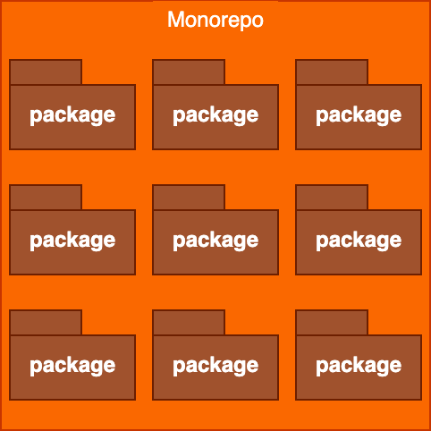
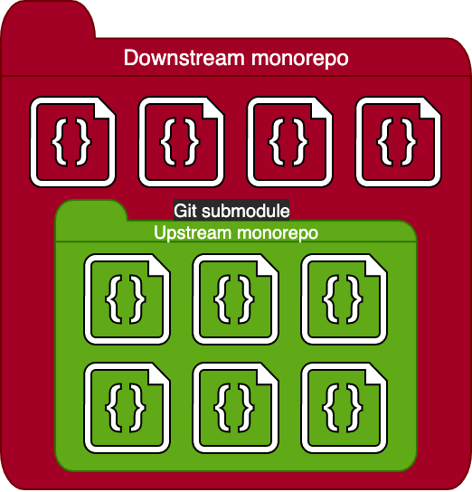
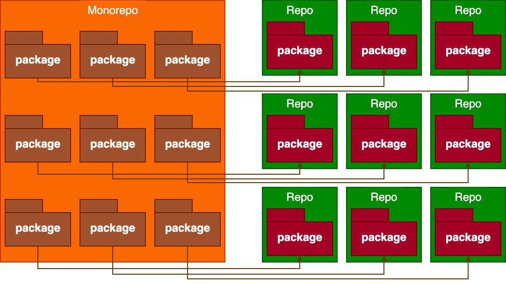

# Multi-Monorepo (Architecture of the Extension Starter)

`GatoGraphQL/ExtensionStarter` is a [monorepo](https://css-tricks.com/from-a-single-repo-to-multi-repos-to-monorepo-to-multi-monorepo/#aa-stage-3-monorepo), containing the codebase for not only one, but multiple extension plugins for Gato GraphQL (and also their composing packages).

`GatoGraphQL/ExtensionStarter` is also a [multi-monorepo](https://css-tricks.com/from-a-single-repo-to-multi-repos-to-monorepo-to-multi-monorepo/#aa-stage-4-multi-monorepo), including the main Gato GraphQL plugin (hosted under the [`GatoGraphQL/GatoGraphQL`](https://github.com/GatoGraphQL/GatoGraphQL) monorepo) as its upstream, via a Git submodule under `submodules/GatoGraphQL`.

The monorepo is managed via the [Monorepo Builder](https://github.com/symplify/monorepo-builder).

The benefits of using the multi-monorepo approach as a starter project are several.

Do packages need to be published to Packagist? 🤔

No. The packages are internal, and the Monorepo Builder can symlink to the internal packages, hence these are not retrieved from [Packagist](https://packagist.org/).

However, as an advanced use case, you do have the option to distribute packages via Packagist (or any other directory). For that, the "Monorepo Split" feature must be enabled (see section [Monorepo Split](#monorepo-split) below), and then you can link to the package on its own repo.

### Automation

There are scripts and workflows to automate (as much as possible) the whole process of creating an extension plugin, from developing it, to testing it, to releasing it.

As a consequence, you only need to concentrate on the actual code for your extension; you won't need to worry about tools and boilerplate for the project (saving you no little time and effort).

### Browse the Gato GraphQL source code

The source code of the Gato GraphQL plugin is always readily-available when developing our extensions, and it is kept up to date just by fetching the Git changes from the upstream repo.

This is important as documentation (mostly when we first start developing with Gato GraphQL) and for debugging (XDebug is integrated out of the box).

### Host the codebase for multiple extensions, and all their packages, all together

The repo contains the source code for not only one, but multiple extension plugins for Gato GraphQL, and also for all their packages.

By hosting all extensions and their packages together, you avoid [dependency hell](https://en.wikipedia.org/wiki/Dependency_hell).

You are also able to do bulk modifications, such as searching and replacing a piece of code across different plugins, in a single action (and push it to the repo using a single commit).

### Continuously access newly-developed code

Once we create a new repository from a GitHub template, the repository and the template are two separate entities. From that moment on, when the template is updated, these changes are not reflected in the repository.

The Gato GraphQL monorepo deals with this issue by providing tools that copy content (code, scripts, workflows, etc) from the Gato GraphQL repo (available as a Git submodule) to the extension project repo. This enables the extension project to be updated when there are changes to the main plugin.

See section [Synchronizing files from the upstream Gato GraphQL repo](../#synchronizing-files-from-the-upstream-gato-graphql-repo) in the README to learn more.

### Use the GitHub Actions workflows developed for the Gato GraphQL plugin

The GitHub Actions workflows developed for the Gato GraphQL plugin are readily-available to create and release our extensions.

This includes Continuous Integration workflows to:

- Generate the plugin (when merging a PR, or creating a release from a tag)
- Scope the extension plugin
- Downgrade the code from PHP 8.1 (for DEV), to PHP 7.2 (for PROD)
- Run coding standard checks (via PHPCS), unit tests (via PHPUnit) and static code analysis (via PHPStan)
- Run integration tests via InstaWP (automatically installing the newly-generated extension plugin on the InstaWP instance)

### Downgrade Code - PHP 8.1 (during DEV) is converted to PHP 7.2 (for PROD)

The source code for the main Gato GraphQL plugin, and any of its extensions, is PHP 8.1.

For distribution, though, the plugin and extensions use PHP 7.2, thanks to a "downgrade" process of its code via [Rector](https://github.com/rectorphp/rector/).

Downgrading code provides the best trade-off between availability of PHP features (during development), and the size of the potential userbase (when releasing the plugin):

- Use the strict typing features from PHP 8.1 (typed properties, union types, and others) to develop the plugin, reducing the possibility it will contain bugs
- Increase the potential number of users who can use your plugin, in production, by releasing it with PHP 7.2

_Not all PHP 8.1 features are available, but only those ones that are "downgradeable" via Rector. Check the list of [Supported PHP features in `GatoGraphQL/GatoGraphQL`](https://github.com/GatoGraphQL/GatoGraphQL/blob/master/docs/supported-php-features.md)._

### Scope 3rd-party libraries

When the extension uses 3rd-party libraries (loaded via Composer), these must be "scoped" by prepending a custom PHP namespace on their source code. This is needed to prevent potential conflicts from other plugins installed in the same WordPress site referencing a different version of the same library.

[PHP-Scoper](https://github.com/humbug/php-scoper) is already integrated in this monorepo (ready to be used whenever needed).

### Lando webservers are ready

Lando is already set-up and configured, making 2 webservers available:

1. A webserver to develop the extensions, using PHP 8.1
2. A webserver to test the generated extension plugins, using PHP 7.2

### The source code is mapped to Lando's DEV webserver

The Lando webserver for DEV (on PHP 8.1) overrides the code deployed within the container, mapping the source code from the repo instead.

As such, changes to the source code will be immediately reflected in the webserver.

### XDebug is already configured

XDebug is already integrated (when using VSCode), supporting:

- The extension's source code
- The main Gato GraphQL plugin's source code (accessible via the Git submodule)
- The WordPress core files

This allows you to add breakpoints in the code, and analyze the full stack trace to see how the code and logic works, anywhere.

### Documentation images in the extension are served from the repo

When generating the extension plugin, images to be displayed in the documentation are excluded from the `.zip` file (thus reducing its size), and referenced directly from the GitHub repo (under `raw.githubusercontent.com`).

### Monorepo Split

Even though the code for all plugins and packages is hosted all together in a monorepo, we can optionally also deploy their code to a separate GitHub repo of their own, via a "Monorepo Split". This happens automatically for all plugins and packages that were modified, when merging a PR.

This is useful for:

- Distributing packages via Composer
- Exploring source code outside of the monorepo

The monorepo split feature is disabled by default. To enable it, return an empty array in method `getExtensionSkipMonorepoSplitPackagePaths` from class [`MonorepoSplitPackageDataSource`](src/Config/Symplify/MonorepoBuilder/DataSources/MonorepoSplitPackageDataSource.php).

### Distribute PROD code to its own repo

Similar to the monorepo split, when generating the plugin for PROD, we can deploy its code (scoped, downgraded, with the Composer autoload generated, etc) into its own repo.

This is useful for:

- Allowing users to create issues, pinpointing where a problem happens
